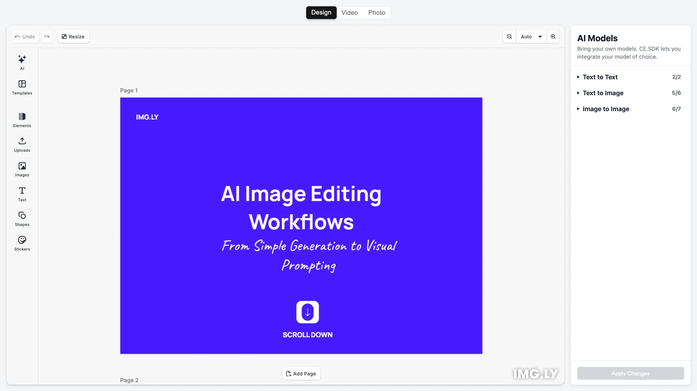

# React AI Editor Starter Kit

Build AI-powered design tools with React and CE.SDK — create content from prompts, transform existing assets, and export to multiple formats. Built with [CE.SDK](https://img.ly/creative-sdk) by [IMG.LY](https://img.ly), runs entirely in the browser with AI providers via secure proxies.

<p>
  <a href="https://img.ly/docs/cesdk/starterkits/ai-editor/">Documentation</a> |
  <a href="https://img.ly/showcases/cesdk">Live Demo</a>
</p>



## Getting Started

### Clone the Repository

```bash
git clone https://github.com/imgly/starterkit-ai-editor-react-web.git
cd starterkit-ai-editor-react-web
```

### Install Dependencies

```bash
npm install
```

### Download Assets

CE.SDK requires engine assets (fonts, icons, UI elements) served from your `public/` directory.

```bash
curl -O https://cdn.img.ly/packages/imgly/cesdk-js/$UBQ_VERSION$/imgly-assets.zip
unzip imgly-assets.zip -d public/
rm imgly-assets.zip
```

### Configure AI Proxies

AI providers require API keys that must NOT be exposed in client-side code. Create a `.env` file with your proxy URLs:

```bash
cp .env.example .env
```

```env
# Fal.ai proxy (for Recraft, Seedream, NanoBanana, Ideogram, Gemini, Flux)
VITE_FAL_AI_PROXY_URL=https://your-server.com/api/proxy/falai

# Anthropic proxy (for Claude)
VITE_ANTHROPIC_PROXY_URL=https://your-server.com/api/proxy/anthropic

# OpenAI proxy (for GPT, GPT Image)
VITE_OPENAI_PROXY_URL=https://your-server.com/api/proxy/openai
```

See [AI Proxy Setup](https://img.ly/docs/cesdk/starterkits/ai-editor/#proxy-setup) for implementation examples.

### Run the Development Server

```bash
npm run dev
```

Open `http://localhost:5173` in your browser.

## Configuration

### Loading Content

Load content into the editor using one of these methods:

```typescript
// Create a blank design canvas
await cesdk.createDesignScene();

// Load from a template archive
await cesdk.loadFromArchiveURL('https://example.com/template.zip');

// Load from a scene file
await cesdk.loadFromURL('https://example.com/scene.json');

// Load from an image
await cesdk.createFromImage('https://example.com/image.jpg');
```

See [Open the Editor](https://img.ly/docs/cesdk/web/guides/open-editor/) for all loading methods.

### Theming

```typescript
cesdk.ui.setTheme('dark'); // 'light' | 'dark' | 'system'
```

See [Theming](https://img.ly/docs/cesdk/web/ui-styling/theming/) for custom color schemes and styling.

### Localization

```typescript
cesdk.i18n.setTranslations({
  de: { 'common.save': 'Speichern' }
});
cesdk.i18n.setLocale('de');
```

See [Localization](https://img.ly/docs/cesdk/web/ui-styling/localization/) for supported languages and translation keys.

### AI Providers

Customize available AI providers in `src/imgly/plugins/ai-app/ai-providers.ts`:

```typescript
// Add a text-to-image provider
text2imageProviders.push({
  name: 'My Custom Model',
  label: 'Custom',
  provider: () => FalAiImage.CustomModel({ proxyUrl: FAL_AI_PROXY_URL })
});
```

| Proxy | Supported Providers |
|-------|---------------------|
| `VITE_FAL_AI_PROXY_URL` | Recraft V3, Seedream V4, NanoBanana Pro, Ideogram V3, Gemini Flash Edit, Flux Pro Kontext |
| `VITE_ANTHROPIC_PROXY_URL` | Claude Sonnet 4.5 |
| `VITE_OPENAI_PROXY_URL` | GPT-4.1 Nano (text), GPT Image 1 (image) |

## Architecture

```
src/
├── app/                          # Demo application
├── imgly/
│   ├── config/
│   │   ├── design-editor/
│   │   │   ├── actions.ts                # Export/import actions
│   │   │   ├── features.ts               # Feature toggles
│   │   │   ├── i18n.ts                   # Translations
│   │   │   ├── plugin.ts                 # Main configuration plugin
│   │   │   ├── settings.ts               # Engine settings
│   │   │   └── ui/
│   │   │       ├── canvas.ts                 # Canvas configuration
│   │   │       ├── components.ts             # Custom component registration
│   │   │       ├── dock.ts                   # Dock layout configuration
│   │   │       ├── index.ts                  # Combines UI customization exports
│   │   │       ├── inspectorBar.ts           # Inspector bar layout
│   │   │       ├── navigationBar.ts          # Navigation bar layout
│   │   │       └── panel.ts                  # Panel configuration
│   │   ├── photo-editor/          # Same structure as design-editor/
│   │   └── video-editor/          # Same structure as design-editor/
│   ├── index.ts                  # Editor initialization function
│   └── plugins/
│       └── ai-app/
│           ├── ai-apps.ts
│           └── ai-providers.ts
└── index.tsx                 # Application entry point
```

## Key Capabilities

- **AI Text Generation** – Generate and transform text with Claude or GPT
- **AI Image Generation** – Create images from prompts with Recraft, Ideogram, and more
- **AI Image Editing** – Transform existing images with Gemini Flash Edit or Flux Kontext
- **Text Editing** – Typography with fonts, styles, and effects
- **Image Placement** – Add, crop, and arrange images
- **Shapes & Graphics** – Vector shapes and design elements
- **Templates** – Start from pre-built design templates
- **Export** – PNG, JPEG, PDF with quality controls

## Prerequisites

- **Node.js v20+** with npm – [Download](https://nodejs.org/)
- **AI Proxy Server** – Secure server to hold API keys (see Configuration)
- **Supported browsers** – Chrome 114+, Edge 114+, Firefox 115+, Safari 15.6+

## Troubleshooting

| Issue | Solution |
|-------|----------|
| Editor doesn't load | Verify assets are accessible at `baseURL` |
| Assets don't appear | Check `public/assets/` directory exists |
| Watermark appears | Add your license key |
| AI features disabled | Verify proxy URLs are configured in `.env` |
| AI requests fail | Check proxy server is running and API keys are valid |

## Documentation

For complete integration guides and API reference, visit the [AI Editor Documentation](https://img.ly/docs/cesdk/starterkits/ai-editor/).

## License

This project is licensed under the MIT License - see the [LICENSE](LICENSE) file for details.

---

<p align="center">Built with <a href="https://img.ly/creative-sdk?utm_source=github&utm_medium=project&utm_campaign=starterkit-ai-editor-react-web">CE.SDK</a> by <a href="https://img.ly?utm_source=github&utm_medium=project&utm_campaign=starterkit-ai-editor-react-web">IMG.LY</a></p>
