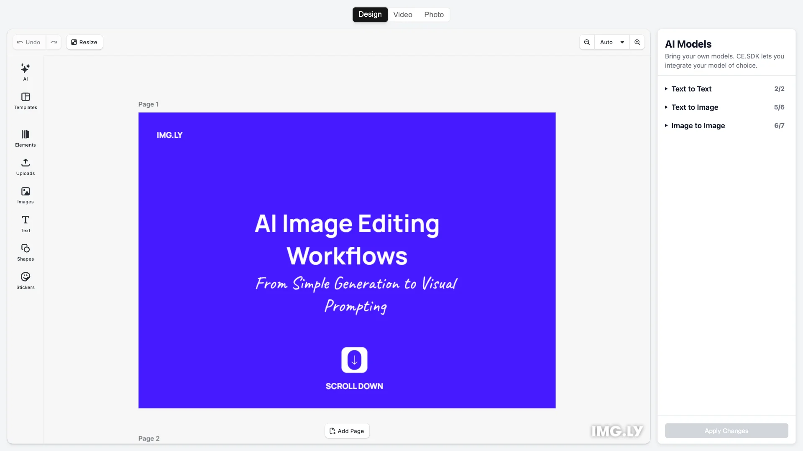

# React AI Editor Starter Kit

Quickly add AI-powered visual editing and media generation to your web app. Built with [CE.SDK](https://img.ly/creative-sdk) by [IMG.LY](https://img.ly) — runs entirely in the browser and talks to every AI model through the **IMG.LY AI Gateway**, so you only need one credential to unlock text, image, video, and audio generation.

<p>
  <a href="https://img.ly/docs/cesdk/js/starterkits/ai-editor-4z6j9l/">Documentation</a>
</p>



## Getting Started

### Clone the Repository

```bash
git clone https://github.com/imgly/starterkit-ai-editor-react-web.git
cd starterkit-ai-editor-react-web
```

### Install Dependencies

```bash
npm install
```

### Download Assets

CE.SDK requires engine assets (fonts, icons, UI elements) served from your `public/` directory.

```bash
curl -O https://cdn.img.ly/packages/imgly/cesdk-js/$UBQ_VERSION$/imgly-assets.zip
unzip imgly-assets.zip -d public/
rm imgly-assets.zip
```

### Configure the AI Gateway

The starterkit routes every AI request through the IMG.LY AI Gateway at `https://gateway.img.ly`. To enable AI features:

1. Create an API key in the [IMG.LY dashboard](https://img.ly/dashboard).
2. Copy `.env.example` to `.env` and paste the key.

```bash
cp .env.example .env
```

```env
# API key from https://img.ly/dashboard
VITE_AI_API_KEY=sk_your_api_key_here
```

> **Heads up.** The key is passed to the gateway via `{ dangerouslyExposeApiKey }` and ends up in the browser. That's fine for local development. For production, swap this out for a short-lived token minted by your backend — see [Gateway Token Action](https://img.ly/docs/cesdk/js/user-interface/ai-integration/integrate-8e906c/) for the pattern used by the `ly.img.ai.getToken` action.

When the starterkit is embedded inside the IMG.LY showcases demo, the hosting page provides a session token via `postMessage` and `VITE_AI_API_KEY` is ignored — no extra setup needed.

### Run the Development Server

```bash
npm run dev
```

Open `http://localhost:5173` in your browser.

## Configuration

### Loading Content

Load content into the editor using one of these methods:

```typescript
// Create a blank design canvas
await cesdk.createDesignScene();

// Load from a template archive
await cesdk.load('https://example.com/template.zip');

// Load from a scene file
await cesdk.load('https://example.com/scene.json');

// Load from an image
await cesdk.createFromImage('https://example.com/image.jpg');
```

See [Open the Editor](https://img.ly/docs/cesdk/js/open-the-editor/load-scene-478833/) for all loading methods.

### Theming

```typescript
cesdk.ui.setTheme('dark'); // 'light' | 'dark' | 'system'
```

See [Theming](https://img.ly/docs/cesdk/js/user-interface/appearance/theming-4b0938/) for custom color schemes and styling.

### Localization

```typescript
cesdk.i18n.setTranslations({
  de: { 'common.save': 'Speichern' }
});
cesdk.i18n.setLocale('de');
```

See [Localization](https://img.ly/docs/cesdk/js/user-interface/localization-508e20/) for supported languages and translation keys.

### AI Providers

Every provider is a `GatewayProvider` bound to a single gateway model id. Add or swap models in `src/imgly/plugins/ai-app/ai-providers.ts`:

```typescript
// Add a text-to-image provider
text2image.providers.push({
  name: 'My Custom Model',
  label: 'Custom',
  selected: true,
  provider: () => ImageGatewayProvider('fal-ai/my-custom-model', gatewayConfig)
});
```

The starterkit ships with a curated list across `text2text`, `text2image`, `image2image`, `text2video`, `image2video`, `text2speech`, and `text2sound`. The full model catalog is served by the gateway at `GET /v1/models` — any id from that response is a valid argument to `*GatewayProvider(modelId, gatewayConfig)`.

## Architecture

```
src/
├── app/                          # Demo application
├── imgly/
│   ├── config/
│   │   ├── design-editor/
│   │   │   ├── actions.ts                # Export/import actions
│   │   │   ├── features.ts               # Feature toggles
│   │   │   ├── i18n.ts                   # Translations
│   │   │   ├── plugin.ts                 # Main configuration plugin
│   │   │   ├── settings.ts               # Engine settings
│   │   │   └── ui/
│   │   │       ├── canvas.ts                 # Canvas configuration
│   │   │       ├── components.ts             # Custom component registration
│   │   │       ├── dock.ts                   # Dock layout configuration
│   │   │       ├── index.ts                  # Combines UI customization exports
│   │   │       ├── inspectorBar.ts           # Inspector bar layout
│   │   │       ├── navigationBar.ts          # Navigation bar layout
│   │   │       └── panel.ts                  # Panel configuration
│   │   ├── photo-editor/          # Same structure as design-editor/
│   │   └── video-editor/          # Same structure as design-editor/
│   ├── index.ts                  # Editor initialization function
│   └── plugins/
│       └── ai-app/
│           ├── ai-apps.ts             # Registers AI plugin + dock/menu integration
│           ├── ai-preflight.ts        # Startup credential check dialog
│           ├── ai-providers.ts        # Gateway provider catalog
│           └── ai-token.ts            # ly.img.ai.getToken action + postMessage bridge
└── index.tsx                 # Application entry point
```

## Key Capabilities

- **AI Text Generation** – Generate and transform text with Claude or GPT
- **AI Image Generation** – Create images from prompts with Recraft, Ideogram, and more
- **AI Image Editing** – Transform existing images with Gemini Flash Edit or Flux Kontext
- **Text Editing** – Typography with fonts, styles, and effects
- **Image Placement** – Add, crop, and arrange images
- **Shapes & Graphics** – Vector shapes and design elements
- **Templates** – Start from pre-built design templates
- **Export** – PNG, JPEG, PDF with quality controls

## Prerequisites

- **Node.js v22+** with npm – [Download](https://nodejs.org/)
- **IMG.LY API key** – Get one from the [IMG.LY dashboard](https://img.ly/dashboard)
- **Supported browsers** – Chrome 114+, Edge 114+, Firefox 115+, Safari 15.6+

## Troubleshooting

| Issue                                        | Solution                                                                                          |
| -------------------------------------------- | ------------------------------------------------------------------------------------------------- |
| Editor doesn't load                          | Verify assets are accessible at `baseURL`                                                         |
| Assets don't appear                          | Check `public/assets/` directory exists                                                           |
| Watermark appears                            | Add your license key                                                                              |
| "AI features are disabled" dialog on startup | Set `VITE_AI_API_KEY` in `.env` using a key from the [IMG.LY dashboard](https://img.ly/dashboard) |
| AI requests fail with an auth error          | The key is missing, expired, or lacks access to the requested model                               |

## Documentation

For complete integration guides and API reference, visit the [AI Editor Documentation](https://img.ly/docs/cesdk/js/starterkits/ai-editor-4z6j9l/).

## Demo Assets

The demo assets for this starter kit load from the IMG.LY CDN by default —
nothing to configure. If you want to own them — edit them, meet compliance
requirements, or remove the CDN dependency for production — eject them
(the archive contains only this kit's files):

```bash
# Download this starter kit's demo assets
curl -O https://staticimgly.com/imgly/cesdk-web-examples-data/1.81.0/starterkit-ai-editor/demo-assets.zip
unzip demo-assets.zip -d demo-assets
rm demo-assets.zip
```

Upload the extracted files to your own server or CDN, then point the app
at them via `.env`:

```bash
VITE_DEMO_ASSETS_BASE_URL=https://cdn.yourdomain.com/demo-assets
```

The default URL is the `DEMO_ASSETS_BASE_URL` constant in `src/app/constants.ts` if you
prefer changing it in code.

The demo assets are intended for development and prototyping — replace
them with your own content or licensed stock assets before shipping to
production (see `DEMO-ASSETS-NOTICE.txt` in the download). This applies in
particular to media such as music tracks and stock imagery.

## License

This project is licensed under the MIT License - see the [LICENSE](LICENSE) file for details.

---

<p align="center">Built with <a href="https://img.ly/creative-sdk?utm_source=github&utm_medium=project&utm_campaign=starterkit-ai-editor-react-web">CE.SDK</a> by <a href="https://img.ly?utm_source=github&utm_medium=project&utm_campaign=starterkit-ai-editor-react-web">IMG.LY</a></p>
